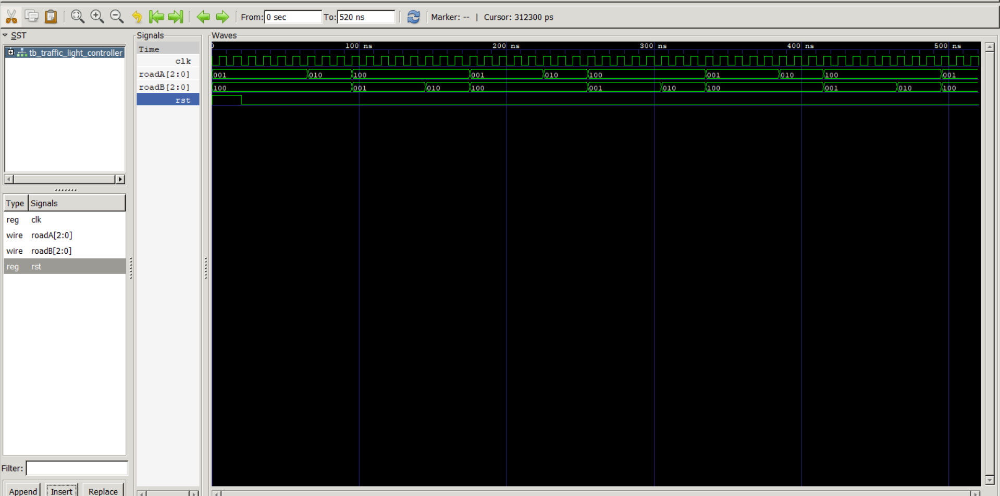
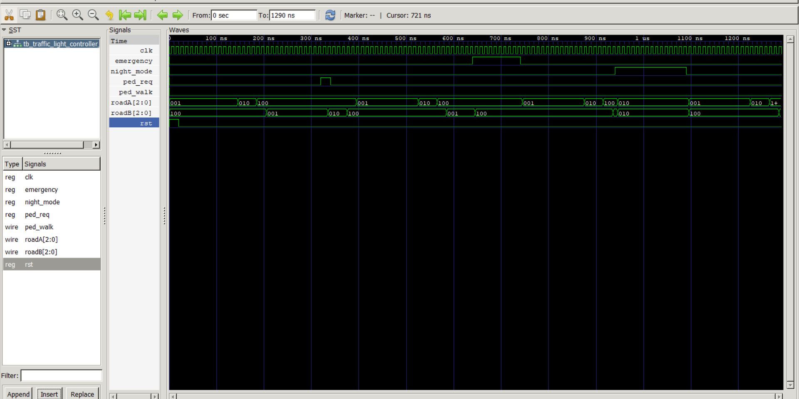

# FPGA-Based Traffic Light Controller Using Verilog HDL

## Overview

This project implements an FPGA-Based Traffic Light Controller using Verilog HDL. The controller is designed using a Finite State Machine (FSM) architecture and includes advanced traffic management features such as pedestrian crossing support, emergency vehicle override, night mode operation, and safety interlocks.

The design was verified using Icarus Verilog and GTKWave waveform analysis.

---

## Features

* Finite State Machine (FSM) Based Design
* Road A and Road B Traffic Signal Control
* Pedestrian Crossing Support
* Emergency Vehicle Override
* Night Mode Operation
* All-Red Safety Interlock States
* Modular Verilog Design
* Testbench-Based Verification
* GTKWave Waveform Analysis
* FPGA-Oriented RTL Design

---

## Traffic States

| State       | Road A       | Road B       |
| ----------- | ------------ | ------------ |
| A_GREEN     | Green        | Red          |
| A_YELLOW    | Yellow       | Red          |
| ALL_RED_1   | Red          | Red          |
| B_GREEN     | Red          | Green        |
| B_YELLOW    | Red          | Yellow       |
| ALL_RED_2   | Red          | Red          |
| PED_WALK    | Red          | Red          |
| EMERG_RED   | Red          | Red          |
| NIGHT_FLASH | Yellow Flash | Yellow Flash |

---

## Project Structure

```text
FPGA-Based-Traffic-Light-Controller

├── rtl
│   ├── traffic_light_controller.v
│   ├── traffic_light_controller_v1.v
│   ├── traffic_light_controller_v2.v
│   ├── clk_en.v
│   ├── timer.v
│   ├── debounce_sync.v
│   └── params.vh

├── tb
│   ├── tb_traffic_light_controller.v
│   └── tb_traffic_light_controller_v2.v

├── waveforms
│   ├── traffic_waveform.png
│   └── traffic_v2_waveform.png

├── README.md
└── .gitignore
```

---

## Tools Used

* Verilog HDL
* Icarus Verilog
* GTKWave
* Digital Logic Design
* Finite State Machines (FSM)

---

## Simulation

### Compile

```bash
iverilog -o sim_v2 rtl/traffic_light_controller_v2.v tb/tb_traffic_light_controller_v2.v
```

### Run

```bash
vvp sim_v2
```

### Open Waveform

```bash
gtkwave traffic_v2.vcd
```

---

## Verification

The controller was verified through simulation and waveform analysis.

Verified functionality:

* Correct FSM Transitions
* Green → Yellow → Red Sequencing
* Road Alternation Logic
* Pedestrian Request Handling
* Emergency Override Operation
* Night Mode Operation
* All-Red Safety States
* Reset Functionality
* No Simultaneous Green Lights

---

## Waveform Results

### Version 1 Waveform



### Version 2 Waveform



---

## Future Enhancements

* FPGA Board Deployment
* Adaptive Traffic Timing
* Vehicle Density Sensors
* UART Monitoring Interface
* RTC-Based Scheduling
* Networked Traffic Junctions
* Formal Verification

---

## Author

**Jatin Gujarathi**

Final Year B.Tech Student

Areas of Interest:

* VLSI Design
* FPGA Design
* Digital Logic Design
* RTL Design
* Functional Verification
